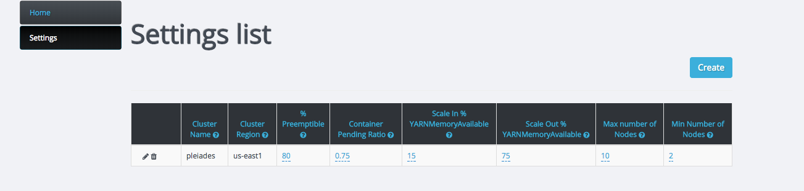
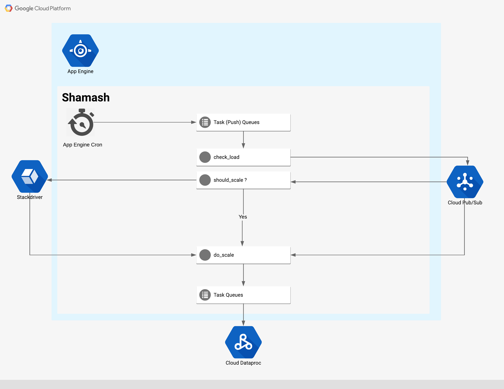

# Shamash - Autoscaling for Dataproc

Shamash is a service for autoscaling Cloud DataProc on Google Cloud Platform(GCP).

[Shamash](https://www.wikiwand.com/en/Shamash) was the god of justice in Babylonia and Assyria, just like
the Shamash auto-scaler whose job is to maintain a tradeoff between costs and
performance.

## Background
Cloud Dataproc is a fast, easy-to-use, fully-managed cloud service for running Apache Spark and Apache Hadoop clusters in a simpler, more cost-efficient way. Operations that used to take hours or days take seconds or minutes instead, and you pay only for the resources you use (with per-second billing).

Cloud Dataproc also easily integrates with other Google Cloud Platform (GCP) services, giving you a powerful and complete platform for data processing, analytics, and machine learning.

Due to different usage patterns (e.g., high load during work hours, no usage overnight), the cluster may become either underprovisioned (users experience, lousy performance) or overprovision (cluster is idle, causing a waste of resources and unnecessary costs).

However, while autoscaling has become state-of-the-art for applications in GCP, currently there exists no out-of-the-box solution for autoscaling of Dataproc clusters.

The "Shamash" autoscaling tool actively monitors the performance of Dataproc clusters and automatically scales the cluster up and down where appropriate. Shamash adds and removes nodes based on the current load of the cluster.

We built Shamash on top of Google App Engine utilizing a serveries architecture. 

### Highlights
* Serverless operation
* Support multiple clusters (each with his own configuration)
* Works without any change to the cluster
* Low TOC

## Installation
Shamash requires both Google Compute Engine, Google Cloud Pub/Sub, Dataproc API and Stackdriver APIs to be enabled to operate properly.

**To enable an API for your project:**

1. Go to the [Cloud Platform Console](https://console.cloud.google.com/).
2. From the projects list, select a project or create a new one.
3. If the APIs & services page isn't already open, open the console left side menu and choose APIs & services, and then select Library.
4. Click the API you want to enable. ...
5. Click ENABLE.

##### Install dependencies

`pip install -r requirements.txt -t lib`

##### Deploy
`./deploy.sh project-id`

## Configuration

* Cluster — Google Dataproc Cluster Name
* Region — Cluster Region
* PreemptiblePct — The ratio of preemptible workers in Dataproc cluster
* UpContainerPendingRatio — The ratio of pending containers allocated to trigger scale out event of the cluster
* UpYARNMemAvailPct — The percentage of remaining memory available to YARN to trigger
* DownYARNMemAvailePct — The percentage of remaining memory available to YARN to trigger scale down
* MinInstances - The least number of workers the cluster will contain, even if the target is not met
* MaxInstances — The largest number of workers allowed, even if the target is exceeded

## Architecture

## Flow

* Every 5 minutes a cron job calls `/tasks/check_load` which create a task per cluster in the task queue.
* Each task is requesting `/do_monitor` with the cluster name as a parameter.
* `/do_monitor` calls `check_load()`
* `check_load()` get the data from the cluster and publishes it to pub/sub`pubsub.publish(pubsub_client, msg, MONITORING_TOPIC)`
* `/get_monitoring_data` is invoked when there is a new message in the monitoring topic and calls /should_scale
* should_scale decide if the cluster has to be rescaled. If yes, trigger_scaling which put data into pub/sub scaling topic
* `/scale` invokes, gets the message from pub/sub and  calls `do_scale`
* Once the calculations are done Shamash will patch the cluster with a new number of nodes.

### Local Development
For local development run:

 `dev_appserver.py --log_level=debug app.yaml`

  You will need a local config.json file in the following structure

`{
"project": "project-id"
}`
